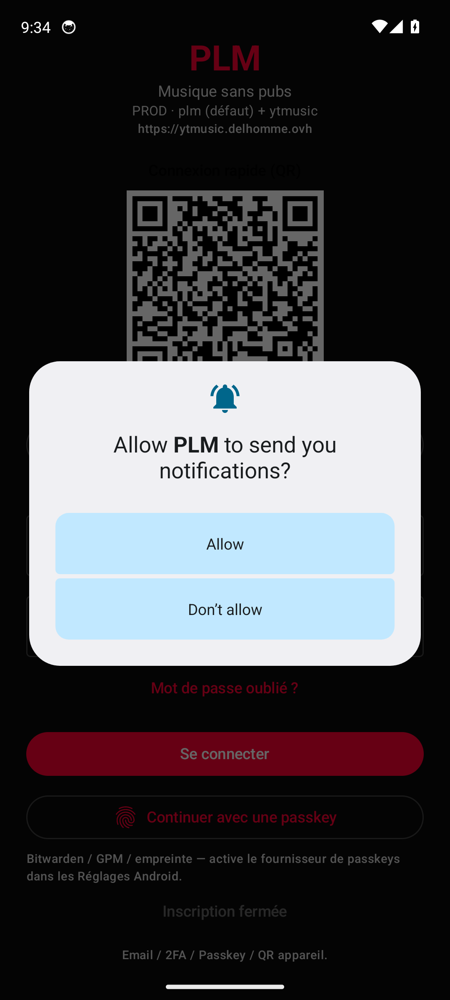

# Diagnostic AVD temporaire PLM — 2026-09-15

## Objectif
Test unique sur AVD puis suppression. Infos conservées ici.

## Environnement AVD
- Nom: `CloudityPLMTemp34` (Pixel 6, API 34, google_apis x86_64)
- Serial: `emulator-5554`
- Lancement stable: `qemu-system-x86_64-headless` + `-no-window -gpu swiftshader_indirect -dns-server 8.8.8.8` via `setsid`
- Android: 14

## Install APK
```
Performing Streamed Install
Success
```
Package:
```
    versionCode=10539 minSdk=26 targetSdk=35
    versionName=p+1.3.239
```
Processus app: `4541`

## Réseau
```
PING 8.8.8.8 (8.8.8.8) 56(84) bytes of data.
64 bytes from 8.8.8.8: icmp_seq=1 ttl=255 time=154 ms

--- 8.8.8.8 ping statistics ---
1 packets transmitted, 1 received, 0% packet loss, time 0ms
rtt min/avg/max/mdev = 154.096/154.096/154.096/0.000 ms

PING ytmusic.delhomme.ovh (95.111.227.204) 56(84) bytes of data.
64 bytes from vmi1296373.contaboserver.net (95.111.227.204): icmp_seq=1 ttl=255 time=501 ms

--- ytmusic.delhomme.ovh ping statistics ---
1 packets transmitted, 1 received, 0% packet loss, time 0ms
rtt min/avg/max/mdev = 501.391/501.391/501.391/0.000 ms
```
Host API: `curl https://ytmusic.delhomme.ovh/api/health` → HTTP 200 (vérifié plus tôt).

## Logcat (erreurs)
```

```

## Problèmes rencontrés pendant le test (à retenir)
1. **ADB double** (`/usr/bin/adb` Arch vs SDK) → `ADB server didn't ACK` / port 5037. Prefer `$ANDROID_HOME/platform-tools/adb`.
2. **Émulateur tué** si `killall adb/emulator` ou `timeout` pendant le boot ; ne pas reset ADB pendant un run.
3. **Snapshots** `Cloudity_S21_FE` incompatibles (feature 117) → cold boot obligatoire.
4. **Mode fenêtre + GPU host** boot parfois puis device offline ; **headless + swiftshader + setsid** plus fiable pour smoke CI.
5. Multi-devices : toujours `-s emulator-XXXX` (physiques USB + Wi‑Fi Nothing/Samsung en parallèle).

## Correctifs appliqués / reco
- DNS explicite `-dns-server 8.8.8.8`
- Install `-r -t` APK prod déjà build (`app-prod-debug.apk`)
- Physique Nothing (Wi‑Fi) installé en parallèle : `ovh.delhomme.ytmusic` **p+1.3.239** OK

## Screenshot


## Suite
AVD `CloudityPLMTemp34` **supprimé** après ce test (demandé). AVDs `Cloudity_S21_FE` / `JobbingTrack_S21_FE` **conservés**.
