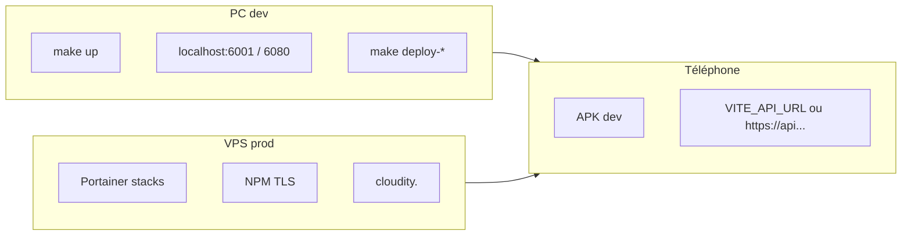

# Déploiement — les 3 environnements (local · préprod VPS · prod)

**Document maître** : lis celui-ci en premier, puis les fiches spécialisées.

| Sujet | Fichier |
|-------|---------|
| **Checklist ordonnée (dev → CI → Portainer → mobile)** | **[DEPLOIEMENT-SUIVI.md](DEPLOIEMENT-SUIVI.md)** |
| **Un seul service** (front, mail, gateway…) | **[DEPLOIEMENT-PAR-SERVICE.md](DEPLOIEMENT-PAR-SERVICE.md)** |
| **VPS + Portainer + NPM** (stacks, réseaux, DNS) | **[DEPLOIEMENT-VPS-PORTAINER-NPM.md](DEPLOIEMENT-VPS-PORTAINER-NPM.md)** · **[PORTAINER-VPS.md](PORTAINER-VPS.md)** |
| **Secrets `.env`** | **[ENV-GENERATION.md](ENV-GENERATION.md)** |
| **Mobile → API** | **[RELEASE-AND-DISTRIBUTION.md](RELEASE-AND-DISTRIBUTION.md)** § 4 |
| **Monorepo aujourd’hui → multi-repo plus tard** | **[../decisions/multi-repo/TRAVAIL-MONOREPO-MAINTENANT.md](../decisions/multi-repo/TRAVAIL-MONOREPO-MAINTENANT.md)** |
| **Liste des conteneurs** | **[../architecture/SERVICES.md](../architecture/SERVICES.md)** |

---

## 1. Ce que tu voulais clarifier (réponse courte)

| Question | Réponse |
|----------|---------|
| `make deploy-web` en local, c’est quoi ? | Rebuild **uniquement** l’image `cloudity-web` + `docker compose up -d cloudity-web`. Le reste de la stack tourne déjà (`make up`). |
| En prod Portainer, l’équivalent ? | Dans la stack **`cloudity-web`** : changer le **tag** de l’image → **Pull & redeploy** **ce** conteneur. |
| Mail, c’est `deploy-web` ? | **Non.** Mail = **`make deploy-mail`** (service `mail-directory-service`). |
| API gateway ? | **`make deploy-gateway`** local · image **`cloudity-api-gateway`** sur Portainer. |
| Déployer **tout** ? | Local : `make up` ou `make rebuild`. VPS : déployer les **8 stacks** dans l’ordre (§ 4). |
| Portainer / NPM en local ? | **Non** en dev : ports directs `6001` / `6080`. NPM **uniquement** sur le VPS. |
| Multi-repo maintenant ? | **Non** : un dossier `Cloudity/` sur ton PC ; déploiement **par image/service** possible **dans le monorepo**. Scission Git = plus tard ([QUESTIONNAIRE](../decisions/multi-repo/QUESTIONNAIRE.md)). |

---

## 2. Les trois environnements

| | **Local (dev)** | **Préprod / prod (VPS)** |
|---|-----------------|-------------------------|
| **Orchestration** | `docker compose` + `Makefile` | **Portainer** (stacks comme Nextcloud) |
| **HTTPS** | Non (HTTP direct) | **Nginx Proxy Manager** + Let’s Encrypt |
| **DNS** | `localhost`, IP LAN (`CORS_ALLOW_LAN`) | FQDN publics → **A** vers `<VPS_PUBLIC_IP>` (hors Git) |
| **Fichier secrets** | `.env` (gitignored) | Variables **stack Portainer** (jamais Git) |
| **Mise à jour front** | `make deploy-web` | Redeploy conteneur `cloudity-web` |
| **Mise à jour mail** | `make deploy-mail` | Redeploy `cloudity-mail-directory-service` |
| **Mobile** | `VITE_API_URL=http://IP_LAN:6080` | `https://api.cloudity.<domaine-principal>` (à créer en DNS+NPM) |

**Préprod** = même VPS et même mode Portainer que la prod, avec un autre tag d’image (`TAG=preprod`) ou un sous-domaine de test (ex. `staging.cloudity.<domaine-principal>`) — pas un troisième outil.

---

## 3. Socle obligatoire vs services optionnels

Pour que **login + hub + une app** fonctionnent, il faut au minimum :

| Couche | Conteneurs | Toujours requis ? |
|--------|------------|-------------------|
| **Données** | `postgres`, `redis`, `db-migrate` | **Oui** |
| **Identité** | `auth-service`, `api-gateway` | **Oui** |
| **Front** | `cloudity-web` | **Oui** (web) |
| **Admin** | `admin-service` | Oui si `/4dm1n` |
| **Pass** | `passwords-service` | Si app Pass |
| **Mail** | `mail-directory-service` | Si app Mail |
| **Drive / Photos / …** | services dédiés | Au fur et à mesure |

En **prod partielle** : tu peux ne déployer que `cloudity-infra` + `cloudity-identity` + `cloudity-web` + `cloudity-pass` + `cloudity-mail`, sans `calendar` / `tasks` tant que le produit n’en a pas besoin.

Détail ports : **[SERVICES.md](../architecture/SERVICES.md)**.

---

## 4. Ordre de déploiement VPS (comme Nextcloud-stack)

Même logique que ta stack **`nextcloud-stack`** :

1. Créer le réseau **`cloudity-data`** (external) une fois.  
2. Stack **`cloudity-infra`** (Postgres + Redis + migrate).  
3. Stack **`cloudity-identity`** (auth + admin + **gateway** sur réseau NPM).  
4. Stacks métier (`cloudity-mail`, `cloudity-pass`, …) — **une par domaine**, redéployables seules.  
5. Stack **`cloudity-web`** (rejoint le réseau **NPM**).  
6. Dans **NPM** : Proxy Hosts vers les `container_name` stables.

Ton cas DNS / réseaux déjà en place : **[PORTAINER-VPS.md](PORTAINER-VPS.md)**.

---

## 5. Mobile : trois façons de tester

| Mode | API | Front |
|------|-----|-------|
| **100 % local** | `http://<IP_PC>:6080` dans `.env` / build Flutter | `http://<IP_PC>:6001` |
| **API sur VPS, dev local** | `https://api.cloudity.<domaine-principal>` | émulateur + machine locale |
| **Tout sur VPS** | idem | `https://cloudity.<domaine-principal>` |

CORS : en prod, `CORS_ORIGINS` doit lister l’origine exacte du front. En dev LAN : `CORS_ALLOW_LAN=true`.

---

## 6. Alias Proton (`alias.<domaine-principal>`) vs Cloudity

Tu as déjà **MX Proton** sur `alias.<domaine-principal>` (alias mail Proton). Ce n’est **pas** incompatible avec Cloudity :

- **Proton** reçoit les mails des alias `@alias.<domaine-principal>` et peut les **transférer** vers ta boîte principale.  
- **Cloudity** (MVP) **enregistre** les mêmes adresses pour **filtrer** dans Mail une fois le message dans la boîte IMAP sync.  
- **Cible** : création d’alias **depuis Pass sans OVH** = chantier **MAIL-ALIAS-05** (MTA Cloudity ou API), pas urgent si Proton gère déjà la réception.

Voir **[../produit/MAIL-ALIAS-DEMARRAGE.md](../produit/MAIL-ALIAS-DEMARRAGE.md)**.

---

## 7. Portainer CE — ce qui est gratuit vs payant

| Fonction | CE (gratuit) | Business (payant) |
|----------|--------------|-------------------|
| Stacks + Compose | Oui | Oui |
| Pull image GHCR / Docker Hub | Oui (ajouter **Registries**) | Oui |
| Auth interne + mot de passe fort | Oui | Oui |
| OAuth / SSO Portainer | Non | Oui |
| mTLS **entre tes apps** | Via NPM + futur `MTLS_MODE` | — |
| **Edge Compute** | Inutile pour ton VPS Docker classique | Agents distants |

**Sécurité Portainer sans payer** : mot de passe fort, session courte, NPM en HTTPS, ne pas exposer le port `9000` publiquement (ou IP allowlist), backups config Portainer (§ Settings).

**Edge Compute** : pour des agents sur des **sites distants** (usines, edge). **Pas nécessaire** pour Cloudity sur un seul VPS.

**Registries** : en CE tu peux ajouter **GHCR** (`ghcr.io`) avec un PAT GitHub pour pull tes images privées.

---

## 8. Index documentation produit / sécurité

Alignement des `.md` : **[../produit/README.md](../produit/README.md)** (fiches produit) · **[../securite/README.md](../securite/README.md)** si présent, sinon **docs/README.md**.

---

*Dernière mise à jour : 2026-05-18.*
