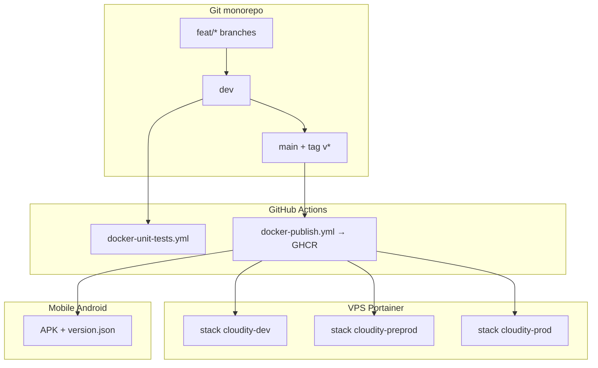

# Feuille de route déploiement — suivi méthodique

**Rôle** : checklist **ordonnée** pour passer du **monorepo local** aux stacks **dev / préprod / prod** sur Portainer, avec **CI GitHub**, **mobile Android**, et **zéro secret dans Git**.

**Documents liés** :

| Sujet | Fichier |
|-------|---------|
| **★ Guide maître (local + mobile + prod)** | **[GUIDE-COMPLET-DEPLOIEMENT-ET-TESTS.md](GUIDE-COMPLET-DEPLOIEMENT-ET-TESTS.md)** |
| Hub 3 environnements | **[DEPLOIEMENT-ENVIRONNEMENTS.md](DEPLOIEMENT-ENVIRONNEMENTS.md)** |
| Un service à la fois | **[DEPLOIEMENT-PAR-SERVICE.md](DEPLOIEMENT-PAR-SERVICE.md)** |
| Secrets | **[ENV-GENERATION.md](ENV-GENERATION.md)** |
| VPS + NPM | **[PORTAINER-VPS.md](PORTAINER-VPS.md)** · **[DEPLOIEMENT-VPS-PORTAINER-NPM.md](DEPLOIEMENT-VPS-PORTAINER-NPM.md)** |
| Mobile / APK | **[RELEASE-AND-DISTRIBUTION.md](RELEASE-AND-DISTRIBUTION.md)** |
| Suivi court (cases) | **[../../TODOS.md](../../TODOS.md)** § *Feuille de route déploiement* |
| Monorepo → multi-repo | **[../decisions/multi-repo/TRAVAIL-MONOREPO-MAINTENANT.md](../decisions/multi-repo/TRAVAIL-MONOREPO-MAINTENANT.md)** |

---

## 0. Où vivent les valeurs sensibles (ex. IP VPS)

| Valeur | **Jamais dans Git** | **Où la mettre** |
|--------|-------------------|------------------|
| `VPS_PUBLIC_IP` | Oui | **Portainer** → Stack → **Environment variables** (ou fichier `.env` **sur le VPS**, référencé par la stack, **gitignored** côté serveur) |
| `POSTGRES_PASSWORD`, `JWT_SECRET`, … | Oui | Idem — copier depuis `make secrets-print` |
| Mots de passe dev faibles (`cloudity_secure_password`) | OK **uniquement** dans `.env` **local** PC | Ton `.env` (déjà dans `.gitignore`) |

**Pas besoin** d’un fichier `*.local.md` dans le dépôt : c’était une option pour des **notes perso hors Git**. La source de vérité VPS = **l’UI Portainer** (recommandé) ou un `.env.deploy` **sur le serveur** uniquement.

Dans la doc versionnée, on écrit **`<VPS_PUBLIC_IP>`** comme **placeholder** ; tu remplaces dans Portainer au moment de créer la stack.

---

## 1. Les quatre « rails » en parallèle

| Rail | Outil | But |
|------|-------|-----|
| **Code** | Git `feat/*` → `dev` → `main` | Intégration propre |
| **Qualité** | `make test` + GHA **`docker-unit-tests.yml`** | Pas de merge cassé |
| **Images** | GHA **`docker-publish.yml`** → **GHCR** | `ghcr.io/<owner>/cloudity-<svc>:<TAG>` |
| **Runtime VPS** | **3 familles de stacks** Portainer + **NPM** | dev / préprod / prod isolées |
| **Mobile** | Flutter build + **`version.json`** HTTPS | Mises à jour sans Play Store (Android) |

---

## 2. Phase A — Local (PC, monorepo, sans Portainer)

| # | Action | Commande / doc | Fait |
|---|--------|----------------|------|
| A1 | Cloner / pull branche chantier | `git pull` | ☐ |
| A2 | Secrets locaux | `make secrets` ou `ensure-*-encryption-key` | ☐ |
| A3 | Stack complète | `make up` | ☐ |
| A4 | Migrations | `make migrate` | ☐ |
| A5 | Compte démo (dev) | `make seed-admin` | ☐ |
| A6 | Tests barrière | `make test` | ☐ |
| A7 | Déployer **un** service | `make deploy-web`, `deploy-mail`, … | ☐ |
| A8 | Mobile sur LAN | `VITE_API_URL` + IP PC — **[RELEASE-AND-DISTRIBUTION.md](RELEASE-AND-DISTRIBUTION.md)** § 4 | ☐ |
| A9 | MTA alias local | `MAIL_ALIAS_DOMAIN`, `MTA_INTERNAL_TOKEN`, `make deploy-mail`, **[MAIL-MTA-LOCAL-TEST.md](MAIL-MTA-LOCAL-TEST.md)** | ☐ |

---

## 3. Phase B — Git & GitHub (PR, CI)

| # | Action | Détail | Fait |
|---|--------|--------|------|
| B1 | Pousser la branche | `git push origin feat/...` | ☐ |
| B2 | Ouvrir **PR** vers **`dev`** | Revue + CI verte | ☐ |
| B3 | Vérifier workflow | **Actions** → `docker-unit-tests` (rejoue `make test`) | ☐ |
| B4 | Merger dans **`dev`** | Intégration continue | ☐ |
| B5 | Quand stable : PR **`dev` → `main`** | Déclenche (ou prépare) publication images | ☐ |
| B6 | Images Docker | **`docker-publish.yml`** sur `main` / tag `v*.*.*` / `workflow_dispatch` | ☐ |
| B7 | Noter le **TAG** publié | ex. `v0.5.0` ou `sha-abc1234` — pour Portainer | ☐ |

> **Monorepo** : un seul dépôt suffit ; le workflow build **12 images** depuis les sous-dossiers `backend/*`, `frontend/`.

---

## 4. Phase C — Portainer : 3 environnements sur le VPS

Même VPS possible ; **3 jeux de stacks** (noms à adapter) pour ne pas mélanger les données :

| Environnement | Préfixe stacks (exemple) | Tag image (ex.) | FQDN (exemple) |
|---------------|--------------------------|-----------------|----------------|
| **Développement** | `cloudity-dev-infra`, `cloudity-dev-identity`, … | `dev` ou `sha-…` | `dev.cloudity.<domaine>` |
| **Préproduction** | `cloudity-preprod-*` | `preprod` ou `rc-*` | `staging.cloudity.<domaine>` |
| **Production** | `cloudity-prod-*` | `v*.*.*` (semver) | `cloudity.<domaine>` |

| # | Action | Détail | Fait |
|---|--------|--------|------|
| C1 | Créer réseau **`cloudity-data-<env>`** | un réseau Postgres/Redis **par** environnement | ☐ |
| C2 | Stack **infra** | postgres + redis + migrate | ☐ |
| C3 | Stack **identity** | auth + admin + gateway (+ réseau NPM) | ☐ |
| C4 | Stacks métier | mail, pass, drive, … selon besoin | ☐ |
| C5 | Stack **web** | `cloudity-web` (+ réseau NPM) | ☐ |
| C6 | Variables Portainer | `POSTGRES_PASSWORD`, `JWT_SECRET`, `VITE_API_URL`, **`VPS_PUBLIC_IP`** si script shell, `CORS_ORIGINS`, … | ☐ |
| C7 | **Update stack** après push GHCR | changer `TAG=` → Pull & redeploy | ☐ |

Ordre détaillé : **[DEPLOIEMENT-VPS-PORTAINER-NPM.md](DEPLOIEMENT-VPS-PORTAINER-NPM.md)** § 3. Exemple domaine : **[PORTAINER-VPS.md](PORTAINER-VPS.md)**.

**Backlog** : fichiers Compose prêts — **`deploy/portainer/`** ([PORTAINER-STACK.md](../../deploy/portainer/PORTAINER-STACK.md)).

---

## 5. Phase D — NPM (HTTPS, par environnement)

| # | Action | Fait |
|---|--------|------|
| D1 | Enregistrement DNS **A** → `<VPS_PUBLIC_IP>` (chez OVH, **hors Git**) | ☐ |
| D2 | Proxy Host **front** → `cloudity-web:3000` | ☐ |
| D3 | Proxy Host **API** → `cloudity-api-gateway:8000` | ☐ |
| D4 | Let's Encrypt + Force SSL | ☐ |
| D5 | `CORS_ORIGINS` / `WEBAUTHN_ORIGINS` = URLs **HTTPS** réelles dans Portainer | ☐ |

---

## 6. Phase E — Mobile Android (par environnement)

| # | Action | Fait |
|---|--------|------|
| E1 | Build APK release | `flutter build apk --release` | ☐ |
| E2 | Héberger APK + **`version.json`** (HTTPS) | **[RELEASE-AND-DISTRIBUTION.md](RELEASE-AND-DISTRIBUTION.md)** — **REL-01..03** | ☐ |
| E3 | App pointe vers bonne API | `https://api.staging...` vs prod | ☐ |
| E4 | Test mise à jour in-app | Android uniquement (pas iOS sans TestFlight) | ☐ |

---

## 7. Phase F — Mise à jour d’un seul composant (quotidien)

| Tu changes… | Local | Portainer (choisir l’env) |
|-------------|-------|---------------------------|
| Front | `make deploy-web` | Redeploy `cloudity-web` stack, `TAG` nouveau |
| API | `make deploy-gateway` | Redeploy gateway |
| Mail | `make deploy-mail` | Redeploy `cloudity-mail-directory-service` |

---

## 8. Ordre recommandé **aujourd’hui** (où tu en es)

1. **Finir Phase A** localement (Pass J8, Mail stable).  
2. **Phase B** : PR `feat/photos-gallery-mobile-sync-security` → **`dev`** (doc déjà sur GitHub).  
3. **Phase C/D** : une première stack **`cloudity-preprod-*`** (ou prod minimale) sur le VPS — pas tout d’un coup.  
4. **Phase E** : après API HTTPS stable.  

---

## 9. Ce qui n’est **pas** encore automatisé (honnête)

| Automatisation | État |
|----------------|------|
| Push Git → Portainer redeploy seul | **Manuel** (changer `TAG` + Update stack) — script VPS possible plus tard |
| 3 stacks dev/preprod/prod complètes | **Doc + backlog** ; Compose `deploy/portainer/` à venir |
| Publication APK + `version.json` | **Backlog REL-01..03** |
| Sync secrets Git → Portainer | **Interdit** — saisie manuelle Portainer |

---

*Dernière mise à jour : 2026-05-18.*
