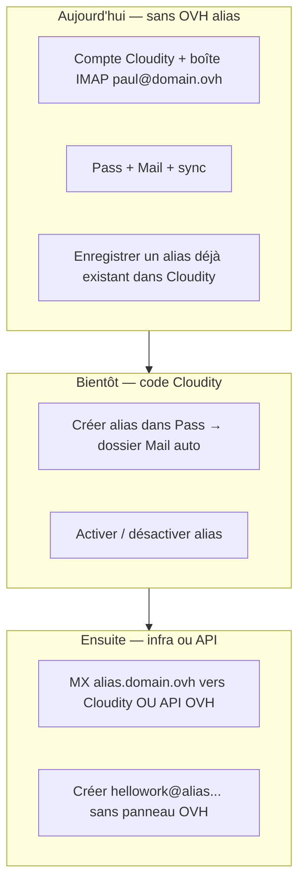

# Alias mail — par où commencer (sans se perdre avec OVH)

**Tu n’as pas encore configuré OVH pour les alias ?** C’est normal : la **création automatique** depuis Pass (**MAIL-ALIAS-05**) n’est pas livrée. Ce document explique **ce qui marche déjà** et **ce qui attend l’infra**.

Vision complète : **[MAIL-ALIAS-VISION.md](MAIL-ALIAS-VISION.md)**.

---

## 1. Noms de domaine (convention)

| Placeholder doc | Exemple réel |
|-----------------|--------------|
| `domain.ovh` | `delhomme.ovh` |
| `paul@domain.ovh` | `paul@delhomme.ovh` |
| Sous-domaine alias `subdomain.domain.ovh` | `alias.delhomme.ovh` |
| Adresse alias | `hellowork@alias.domain.ovh` |

Dans **`.env`** (futur) :

```env
MAIL_PRIMARY_DOMAIN=domain.ovh
MAIL_ALIAS_SUBDOMAIN=alias.domain.ovh
```

---

## 2. Trois niveaux (simple)



---

## 3. Ce que tu peux faire **sans** toucher OVH maintenant

1. **`make secrets`** + **`make doctor`** — clés `.env` OK.  
2. **Compte Cloudity** avec ton email principal (plus tard `paul@domain.ovh` ; dev : `admin@cloudity.local`).  
3. **Mail** : connecter la boîte IMAP **principale** (celle qui reçoit déjà le courrier).  
4. **Pass** : importer Proton (CSV), déverrouiller le coffre.  
5. **Alias déjà existants** (ex. créés avant sur OVH ou Proton) :  
   - si l’adresse **reçoit** déjà du mail sur ta boîte IMAP → **Pass → Alias mail** → enregistrer la **même** adresse ;  
   - **Mail** → filtre latéral sur cet alias.

**Tu n’as pas besoin d’OVH** pour utiliser Cloudity Mail + Pass sur ta boîte **principale**.

---

## 4. Pourquoi un nouvel alias `@alias.domain.ovh` ne marche pas « tout seul »

Internet envoie le courrier selon les enregistrements **DNS (MX)** du domaine `alias.domain.ovh`.

- Si **personne** ne gère ce sous-domaine (ni OVH, ni serveur Cloudity), les messages vers `nouveau@alias.domain.ovh` **ne arrivent nulle part**.  
- **Enregistrer** l’adresse dans Cloudity = dire à l’app « quand un mail avec ce *À* apparaît dans ma boîte, montre-le ici » — **pas** créer la boîte sur Internet.

**Cible produit** : un clic dans Pass créera l’alias **et** le routage (**MAIL-ALIAS-05**). En attendant :

| Option | Effort | Qui crée l’alias réseau |
|--------|--------|-------------------------|
| **A — Attendre Cloudity MTA** | MX `alias.domain.ovh` → ton VPS (**AS-1**) | Cloudity |
| **B — API OVH** (futur) | Clés API dans `.env` | Cloudity appelle OVH |
| **C — Une fois à la main OVH** | Manager OVH → alias → redirection vers `paul@domain.ovh` | Toi (une fois par alias) |

Tu as dit vouloir **ne plus ouvrir OVH** : c’est l’option **A** ou **B**, pas encore disponible.

---

## 5. Scénario HelloWork (quand ce sera prêt)

1. Pass → « Alias pour hellowork.com » → `hellowork@alias.domain.ovh`.  
2. Cloudity provisionne (API/MTA).  
3. Tu changes l’email sur HelloWork.  
4. Mail → dossier / filtre **HelloWork**.  
5. Envoi avec **De :** `hellowork@alias.domain.ovh`.

**Aujourd’hui** : utilise ta boîte principale sur HelloWork, ou un alias **déjà** routé chez OVH + enregistré dans Cloudity.

---

## 6. Liens

- **[ENV-GENERATION.md](../operations/ENV-GENERATION.md)** — clés `.env`  
- **[BACKLOG.md](../../BACKLOG.md)** — MAIL-ALIAS-01…06  
- **[SYNC-BACKLOG.md](SYNC-BACKLOG.md)** § 2  

---

*Dernière mise à jour : 2026-05-18.*
