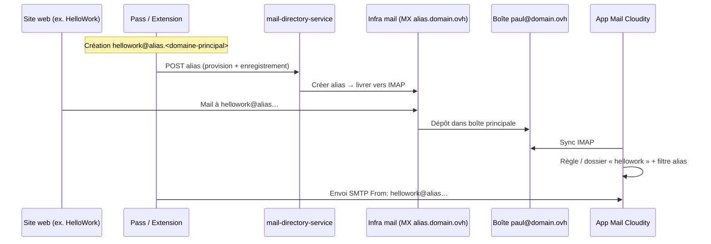

# Vision produit — Alias mail Cloudity (Pass ↔ Mail)

**Décision actée (2026-05-18)** : le parcours cible est décrit ci-dessous. Il **ne** correspond **pas** encore entièrement au code en production : voir § 3 (*écart*) et **[BACKLOG.md](../../BACKLOG.md)** (épique **MAIL-ALIAS-*** ).

> **Complément pratique** (Proton / OVH / « je n’ai rien configuré ») : **[MAIL-ALIAS-DEMARRAGE.md](MAIL-ALIAS-DEMARRAGE.md)** — ce fichier reste la **référence cible** ; l’autre est le **guide de démarrage**.

---

## 1. Parcours utilisateur cible

Compte Cloudity unique (ex. **`paul@domain.ovh`** — aujourd’hui dev : `admin@cloudity.local`) : Drive, Calendar, Office, Mail, Pass, panel admin si compte principal. Convention doc : **`domain.ovh`** = ton domaine réel (ex. `<domaine-principal>`).

### 1.1 Compte et Mail

1. Inscription / connexion Cloudity avec l’email principal (`paul@domain.ovh`).
2. **Mail** : connexion IMAP automatique (ou OAuth) — dossiers, sync, règles et dossiers **gérés dans Cloudity** (logique produit), synchronisés avec le serveur distant quand l’API IMAP le permet.
3. Pas de configuration manuelle « par site » dans OVH pour chaque alias : **tout se fait dans Cloudity**.

### 1.2 Pass (coffre + alias)

1. Coffre Pass par défaut (comme Proton) ; sous-coffres / dossiers d’entrées optionnels.
2. Section **Alias mail** : créer `hellowork@alias.<domaine-principal>` (sous-domaine fixe **`alias.<domaine-principal>`** — ex. `alias.<domaine-principal>` si le compte est `@<domaine-principal>` ; placeholder générique : **`subdomain.domain.ovh`** = `alias.domain.ovh`).
3. Depuis l’**extension** ou le **web** : lors d’une inscription, proposer « créer un alias pour ce site » → même API.
4. **Pas de catch-all** : chaque alias est explicite (`local@alias.domain.ovh`).

### 1.3 Réception et tri (Mail)

1. Les messages envoyés à `hellowork@alias.<domaine-principal>` arrivent dans la boîte reliée au compte Cloudity.
2. Dans **Mail** : vue / dossier / filtre **par alias** (ex. section « HelloWork »), accessible quelle que soit la boîte IMAP connectée sur ce compte.
3. **Activer / désactiver** un alias (pause, anti-spam) sans supprimer l’historique.
4. Règles Cloudity (tags, dossiers, `mail_filter_rules`) appliquées à la sync.

### 1.4 Envoi

1. Composer avec **De :** `hellowork@alias.<domaine-principal>`.
2. Le destinataire voit **`hellowork@alias.<domaine-principal>`** (en-tête `From`), pas seulement la boîte technique d’authentification SMTP.
3. Authentification SMTP alignée (SPF/DKIM sur le domaine alias ou relais signé) — voir infra § 4.

---

## 2. Ce qui est opérationnel aujourd’hui (MVP)

| Capacité | État | Détail technique |
|----------|------|------------------|
| Compte Cloudity + apps | Oui (dev / prod partielle) | JWT, multi-apps ; dev : `admin@cloudity.local`. |
| Mail IMAP sync + dossiers + règles | Oui (avancé) | `mail-directory-service`, sync multi-dossiers, `mail_filter_rules`. |
| Pass coffre E2EE | Oui | `@cloudity/pass-crypto`, import Proton JSON/CSV. |
| **Enregistrer** un alias dans Cloudity | Oui | `user_email_aliases` — `POST /mail/me/accounts/:id/aliases` (Pass + Mail). |
| Filtrer les messages par alias | Oui | `GET …/messages?delivered_to=<alias>` sur `to_addrs`. |
| Envoyer avec `From` alias | Partiel | `from_email` + alias enregistré ; enveloppe SMTP = compte IMAP (limitation fournisseur). |
| **Créer** l’alias chez le fournisseur (OVH) depuis Cloudity | **Non** | Aucun appel API OVH ni MTA Cloudity généraliste. |
| Dossier auto par alias à la création | **Non** | À brancher (règle + tag ou dossier IMAP). |
| Activer / désactiver alias | **Non** | Pas de colonne `enabled` sur `user_email_aliases`. |
| Extension « créer alias pour ce site » | **Non** | **MP-06** / **MAIL-ALIAS-04**. |
| MX `alias.domain.ovh` géré par Cloudity | **Non** | **AS-1** (Postfix/Dovecot/Rspamd) ou API OVH. |

**Sans OVH configuré pour l’instant** : voir **[MAIL-ALIAS-DEMARRAGE.md](MAIL-ALIAS-DEMARRAGE.md)**.

**Conséquence honnête** : tant que l’étape « provision MTA / OVH » n’est pas livrée, il faut **encore** créer l’alias chez le fournisseur **ou** pointer le MX du sous-domaine `alias.*` vers l’infra Cloudity. Cloudity seul **enregistre** l’adresse pour l’UX (filtre, envoi documenté).

---

## 3. Écart explicite (ce que tu ne dois plus avoir à faire — cible)

| Aujourd’hui (MVP) | Cible (ton processus) |
|-------------------|------------------------|
| Créer la redirection dans le manager OVH | **Un clic dans Pass** → provision API + DB |
| Recopier l’alias dans Pass après OVH | **Création unique** dans Pass |
| Trier à la main dans l’INBOX | **Dossier / vue par alias** automatique |
| Désactiver = supprimer chez OVH | **Toggle actif** dans Mail / Pass |

---

## 4. Phasage technique (ordre recommandé)

| Id | Livrable | Dépendances |
|----|----------|-------------|
| **MAIL-ALIAS-01** | Colonne `enabled`, `disabled_at`, UI toggle Pass/Mail | Migration SQL |
| **MAIL-ALIAS-02** | À la création alias : règle filtre + tag/dossier « alias:&lt;local&gt; » | `mail_filter_rules`, sync |
| **MAIL-ALIAS-03** | Config domaine : `MAIL_ALIAS_SUBDOMAIN` (ex. `alias.domain.ovh`) + validation `*@alias.<primary>` | `.env`, auth profil email |
| **MAIL-ALIAS-04** | Extension / Pass : « Alias pour ce site » → `local` dérivé du hostname | **MP-06** |
| **MAIL-ALIAS-05** | **Provision réelle** (sans panneau OVH) — **une** des options : | |
| | **5a** API OVH (credentials admin domaine stockés chiffrés `ALIAS_ENCRYPTION_KEY`) | Compte API OVH |
| | **5b** MTA Cloudity sur `alias.*` (MX → VPS, table `mail_aliases` + Postfix) | **AS-1** |
| **MAIL-ALIAS-06** | Envoi : `From` visible + DKIM aligné sur sous-domaine alias | SPF/DKIM **AS-1** |
| **MAIL-ALIAS-KEY-01** | Utiliser `ALIAS_ENCRYPTION_KEY` pour secrets API OVH / tokens provision | Voir **SECRETS.md** |

**Pas de catch-all** : seule la voie **5a/5b** par alias nominatif.

---

## 5. Variables d’environnement (`.env.example`)

| Variable | Rôle |
|----------|------|
| `MAIL_PASSWORD_ENCRYPTION_KEY` | **Opérationnel** — mots de passe IMAP/SMTP chiffrés (AES-GCM). |
| `ALIAS_ENCRYPTION_KEY` | **Présent, pas encore utilisé en Go** — réservé API OVH / champs sensibles alias (**MAIL-ALIAS-KEY-01**). |
| `MAIL_ALIAS_SUBDOMAIN` | *(futur)* ex. `alias.domain.ovh` |
| `MAIL_PRIMARY_DOMAIN` | *(futur)* ex. `domain.ovh` |
| `OVH_API_*` | *(futur, option 5a)* provision sans UI OVH |

Génération : `make secrets` ou `make ensure-mail-encryption-key` + `make ensure-alias-encryption-key`.

---

## 6. Références code

- Enregistrement utilisateur : `user_email_aliases` — migration `16-mail-user-aliases.sql`, `18-mail-alias-deliver-target.sql`.
- Admin domaine (futur MTA) : `mail_aliases` — `POST /mail/domains/:id/aliases` (admin only).
- UI Pass : `PassMailAliasesPanel.tsx`.
- Filtre Mail : `delivered_to` dans `main.go` (`listMessages`).
- Envoi : `sendMessageSMTP` — vérif alias enregistré pour `from_email`.

---

*Dernière mise à jour : 2026-05-18.*
