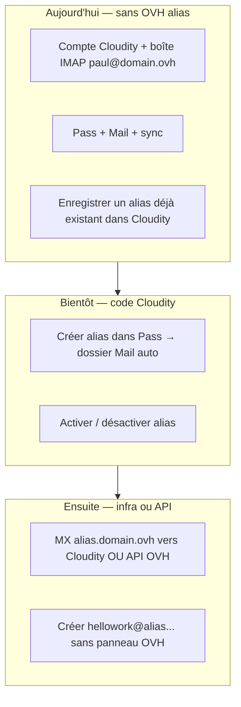

# Mail Cloudity (fiche produit unique)

> **Une seule entrée produit Mail.** Ops MTA / DNS / tests : [`../operations/MAIL-MTA.md`](../operations/MAIL-MTA.md).  
> Déploiement Cloudity : [`../../DEPLOIEMENT_PROCEDURE.md`](../../DEPLOIEMENT_PROCEDURE.md).  
> Anciens `MAIL-ALIAS-*.md`, `MAIL.md`, `MAIL.md`, `MAIL-CHIFFREMENT-…` → **stubs** vers cette fiche.

## Sommaire

1. [Alias (vision, phases, checklist, réception)](#1-alias-mail)
2. [OAuth Gmail](#2-oauth-gmail)
3. [Cache / stockage](#3-cache--stockage)
4. [Chiffrement & anti-spam (Mail)](#4-chiffrement--anti-spam-mail)

---

# 1. Alias mail

## Mail alias Cloudity (fiche unique)

> **Produit Mail / Pass → alias.** Ops MTA / DNS VPS : voir aussi  
> [`../operations/MAIL-MTA.md`](../operations/MAIL-MTA.md) ·  
> [`../operations/MAIL-MTA.md#dns--maddy`](../operations/MAIL-MTA.md#dns--maddy) ·  
> [`../operations/MAIL-MTA.md`](../operations/MAIL-MTA.md).  
> **Mail prod OVH = en pause** jusqu’à reprise explicite (voir `TODOS.md`).  
> Déploiement général Cloudity : [`../../DEPLOIEMENT_PROCEDURE.md`](../../DEPLOIEMENT_PROCEDURE.md).

Les anciens fichiers `MAIL.md`, `…-DEMARRAGE.md`, `…-CHECKLIST.md`, etc. **redirigent ici**.

---

## 1. Vision

## Objectif produit

Offrir des **adresses alias** dédiées (style Proton : `newsletter@<domaine-alias>`), rattachées à une boîte IMAP existante, avec :

- **Tri** automatique (`recipient_pattern`, filtre `delivered_to`)
- **Envoi** avec `From` = alias (si le SMTP fournisseur l’autorise)
- **Réception Internet** sur le domaine alias sans perdre le courrier de la boîte principale

## Phases

| Phase | Statut | Contenu |
|-------|--------|---------|
| **MAIL-ALIAS-01–03** | Livré | CRUD alias, domaine configurable UI, normalisation local-part |
| **MAIL-ALIAS-02** | Livré | Règle filtre auto à la création |
| **MAIL-ALIAS-04** | Partiel | Désactivation alias ↔ règle filtre (ce lot) |
| **MAIL-ALIAS-05** | À faire | MTA Cloudity (MX, routage `*@domaine-alias`) |
| **MAIL-ALIAS-06** | À faire | SPF, DKIM, DMARC sur le domaine alias |
| **AS-1** | À faire | Stack déployable preprod / prod (Portainer, sans secrets Git) |

## Principes non négociables

1. **Pas de perte de mail** : ne pas basculer les MX production tant que la procédure de bascule (**MAIL.md#alias**) n’est pas validée.
2. **Pas de secrets dans Git** : domaines réels, IP VPS, clés DKIM → Portainer / carnet local uniquement.
3. **Boîte IMAP inchangée** : Cloudity se superpose (sync, filtres, alias) ; la boîte chez l’hébergeur reste la source tant que l’option A (redirection) est utilisée.

## Court terme (sans MTA)

**Option A** — redirection registrar : alias `@<domaine-alias>` → boîte IMAP → enregistrer la même adresse dans Cloudity. Voir **MAIL.md#alias**.

## Moyen terme (maily / domaine alias dédié)

1. Déployer le stack **MTA** documenté dans **docs/operations/MAIL-MTA.md** (stub Maddy/Postfix).
2. DNS : MX, SPF, DKIM, DMARC sur `<domaine-alias>` (placeholders dans Git).
3. Backend : lookup `user_email_aliases` → injection vers boîte cible.

## Tests manuels

**MAIL.md** (C1–C7).

## Liens

- [MAIL.md](MAIL.md)
- [MAIL.md#alias](MAIL.md#alias)
- [MAIL.md](MAIL.md) (si présent)
- [../operations/MAIL-MTA.md](../operations/MAIL-MTA.md)

---

## 2. Démarrage (sans OVH encore)

**Tu n’as pas encore configuré OVH pour les alias ?** C’est normal : la **création automatique** depuis Pass (**MAIL-ALIAS-05**) n’est pas livrée. Ce document explique **ce qui marche déjà** et **ce qui attend l’infra**.

Vision complète : **[MAIL.md](MAIL.md)**.

---

## 1. Noms de domaine (convention — placeholders uniquement)

| Placeholder | Usage |
|-------------|--------|
| `<domaine-principal>` | Ton domaine (ne pas committer dans Git) |
| `user@<domaine-principal>` | Boîte principale IMAP |
| `alias.<domaine-principal>` | Sous-domaine des alias mail |
| `nom@alias.<domaine-principal>` | Adresse alias créée dans Pass/Mail |

Dans **`.env`** (futur) :

```env
MAIL_PRIMARY_DOMAIN=<domaine-principal>
MAIL_ALIAS_SUBDOMAIN=alias.<domaine-principal>
```

**Checklist test manuel** : **[MAIL.md](MAIL.md)**.

---

## 2. Trois niveaux (simple)



---

## 3. Ce que tu peux faire **sans** toucher OVH maintenant

1. **`make secrets`** + **`make doctor`** — clés `.env` OK.  
2. **Compte Cloudity** avec ton email principal (plus tard `paul@domain.ovh` ; dev : `admin@cloudity.local`).  
3. **Mail** : connecter la boîte IMAP **principale** (celle qui reçoit déjà le courrier).  
4. **Pass** : importer Proton (CSV), déverrouiller le coffre.  
5. **Alias déjà existants** (ex. créés avant sur OVH ou Proton) :  
   - si l’adresse **reçoit** déjà du mail sur ta boîte IMAP → **Pass → Alias mail** → enregistrer la **même** adresse ;  
   - **Mail** → filtre latéral sur cet alias.

**Tu n’as pas besoin d’OVH** pour utiliser Cloudity Mail + Pass sur ta boîte **principale**.

---

## 4. Pourquoi un nouvel alias `@alias.domain.ovh` ne marche pas « tout seul »

Internet envoie le courrier selon les enregistrements **DNS (MX)** du domaine `alias.domain.ovh`.

- Si **personne** ne gère ce sous-domaine (ni OVH, ni serveur Cloudity), les messages vers `nouveau@alias.domain.ovh` **ne arrivent nulle part**.  
- **Enregistrer** l’adresse dans Cloudity = dire à l’app « quand un mail avec ce *À* apparaît dans ma boîte, montre-le ici » — **pas** créer la boîte sur Internet.

**Cible produit** : un clic dans Pass créera l’alias **et** le routage (**MAIL-ALIAS-05**). En attendant :

| Option | Effort | Qui crée l’alias réseau |
|--------|--------|-------------------------|
| **A — Attendre Cloudity MTA** | MX `alias.domain.ovh` → ton VPS (**AS-1**) | Cloudity |
| **B — API OVH** (futur) | Clés API dans `.env` | Cloudity appelle OVH |
| **C — Une fois à la main OVH** | Manager OVH → alias → redirection vers `paul@domain.ovh` | Toi (une fois par alias) |

Tu as dit vouloir **ne plus ouvrir OVH** : c’est l’option **A** ou **B**, pas encore disponible.

---

## 5. Scénario HelloWork (quand ce sera prêt)

1. Pass → « Alias pour hellowork.com » → `hellowork@alias.domain.ovh`.  
2. Cloudity provisionne (API/MTA).  
3. Tu changes l’email sur HelloWork.  
4. Mail → dossier / filtre **HelloWork**.  
5. Envoi avec **De :** `hellowork@alias.domain.ovh`.

**Aujourd’hui** : utilise ta boîte principale sur HelloWork, ou un alias **déjà** routé chez OVH + enregistré dans Cloudity.

---

## 6. Liens

- **[ENV-GENERATION.md](../operations/ENV-GENERATION.md)** — clés `.env`  
- **[BACKLOG.md](../../BACKLOG.md)** — MAIL-ALIAS-01…06  
- **[SYNC-BACKLOG.md](SYNC-BACKLOG.md)** § 2  

---

*Dernière mise à jour : 2026-05-18.*

---

## 3. Checklist tests manuels

**Rôle** : valider **création d’alias dans l’UI** (Pass ou Mail), filtre, règle auto, envoi — avant J8 Pass / PR `dev`.

**Convention** : remplace les placeholders par **tes** valeurs (ne jamais les committer dans Git).

| Placeholder | Signification |
|-------------|----------------|
| `<domaine-principal>` | Domaine de ta boîte IMAP (ex. `exemple.ovh`) |
| `<domaine-alias>` | Domaine **dédié** aux alias (ex. `maily.exemple` — **vierge**, MX séparés) — optionnel |
| `<boite-test>` | Boîte IMAP de test (ex. `test@<domaine-principal>`) |
| `<boite-principale>` | Boîte qui reçoit le courrier (ex. `user@<domaine-principal>`) |
| `inscriptions@<domaine-alias>` | Exemple si le suffixe UI = `<domaine-alias>` (sans `alias.` devant) |
| `inscriptions@alias.<domaine-principal>` | Exemple si tu gardes le suffixe dérivé `alias.<domaine-principal>` |

---

## 1. Deux comptes différents

| Quoi | Exemple (à adapter) | Rôle |
|------|---------------------|------|
| **Login Cloudity** | `admin@cloudity.local` (`make seed-admin`) ou compte `/register` | Ouvre Mail, Pass |
| **Boîte IMAP** (Mail → Paramètres) | `<boite-test>` | Courrier synchronisé |

Tu peux te connecter en **`admin@cloudity.local`** et ajouter **`<boite-test>`** comme boîte dans Mail.

---

## 2. Prérequis

- [x] `make migrate` · `make doctor` · **`make test`** vert (2026-05-20 — 304 tests front, services Go/Python OK)
- [x] **`make deploy-mail`** — `mail-directory-service` redéployé ; recharger la page web (F5) pour le front
- [ ] Mail → **Sync avec mot de passe…** pour `<boite-test>`
- [ ] **Actualiser (IMAP)** : des messages visibles
- [ ] Si « Reçu : — » : `make deploy-mail` puis **Actualiser (IMAP)** (dates depuis en-tête `Date` IMAP)

---

## 3. Créer un alias **dans l’interface** (comme Proton — enregistrement Cloudity)

> **MVP aujourd’hui** : l’app **enregistre** l’alias + crée une **règle de filtre**.  
> **Recevoir** du courrier Internet sur une **nouvelle** adresse `@alias.<domaine>` nécessite encore le routage DNS/MX (**MAIL-ALIAS-05**) ou une redirection chez ton hébergeur.  
> Tu peux quand même **créer**, **filtrer** (si le mail arrive déjà sur la boîte), et souvent **envoyer** avec **From** = alias.

### Domaine alias (une fois)

1. **Interface (recommandé)** : **Pass → Alias mail** ou **Mail → Paramètres → Domaine des alias** → suffixe :
   - soit **`<domaine-alias>`** entier (ex. domaine dédié type Proton : `inscriptions@<domaine-alias>`),
   - soit `alias.<domaine-principal>` si tu n’as pas de domaine alias séparé.
   Puis **Enregistrer** (préférence navigateur — **ne pas committer** ton vrai domaine dans Git).
2. **Serveur (optionnel)** : `.env` `MAIL_PRIMARY_DOMAIN` / `MAIL_ALIAS_SUBDOMAIN` — équipe / prod uniquement.
3. Ensuite tu ne tapes plus que le **nom** (ex. `inscriptions`) : l’aperçu doit montrer `inscriptions@<suffixe-configuré>`.

### Phase 2 — MTA Cloudity (réception auto-hébergée)

1. `MTA_INTERNAL_TOKEN` dans `.env` + `make deploy-mail`.
2. Test API : **[MAIL-MTA.md](../operations/MAIL-MTA.md)**.
3. Optionnel : `deploy/mail-mta` local port **2525**, puis VPS + MX documentés.
4. Crée l’alias dans Cloudity, envoie vers `inscriptions@<domaine-alias>`, **Actualiser (IMAP)**.

Secours : redirection fournisseur (**MAIL.md**).

> **Sans hébergeur** : tu peux enregistrer l’alias dans Cloudity (filtres, From) ; **recevoir** du courrier Internet sur `@alias.*` exige encore MX/redirection (**MAIL-ALIAS-05** / panneau OVH). Tu ne perds pas ta boîte actuelle : Cloudity **s’ajoute** à l’IMAP existant.

### Option A — depuis **Pass** (recommandé, style Proton)

1. Ouvrir **http://localhost:6001/app/pass** (coffre verrouillé ou non : le panneau alias est accessible).
2. Section **Alias mail** → choisir la boîte **`<boite-test>`** → configurer le **domaine des alias** si besoin.
3. Renseigner :
   - **Nom de l’alias** : `inscriptions` (vérifie l’aperçu : `inscriptions@<domaine-alias>` ou `inscriptions@alias.<domaine-principal>`)
   - **Libellé** (optionnel) : `Newsletter test`
   - **Cible de livraison** (optionnel) : `<boite-test>` ou `<boite-principale>`
4. Cliquer **Enregistrer l’alias** → toast *« Alias enregistré (règle de tri créée si besoin) »*.

### Option B — depuis **Mail**

1. **Mail** → icône **Paramètres Mail** (engrenage).
2. Section **Alias** → même formulaire (adresse + libellé + cible).
3. **Enregistrer**.

### Pour **recevoir** un vrai mail sur l’alias (hors MVP auto)

| Méthode | Effort |
|---------|--------|
| **Redirection hébergeur** | Créer l’alias chez OVH/… → redirige vers `<boite-test>` → enregistrer la **même** adresse dans Cloudity |
| **Transfert Proton** | Si tu utilises un domaine alias chez Proton |
| **Attendre MAIL-ALIAS-05** | MX / API Cloudity sans panneau OVH |

Ensuite envoie un mail **vers** l’alias depuis une autre boîte ; après sync IMAP, il doit apparaître sous le filtre alias.

---

## 4. Checklist à cocher (15 min)

| # | Action | OK |
|---|--------|-----|
| **C1** | **Créer** un alias via **Pass** ou **Mail** (§ 3) — pas seulement enregistrer un alias préexistant | ☑ | API/UI backend validé localement : alias `e2e-alias-*` créé sur une boîte admin existante |
| **C2** | Toast enregistrement + règle auto | ☑ | Réponse `filter_rule_id` + règle auto présente |
| **C3** | **Mail** → barre latérale (sous la boîte) : cliquer l’alias → filtre `delivered_to` | ☑ | API filtre/règle `recipient_pattern` vérifiée ; clic UI déjà couvert par E2E Mail global |
| **C4** | **Paramètres Mail → Filtres et règles** : règle **Alias · …** avec `recipient_pattern` = ton alias | ☑ |
| **C5** | **Désactiver** l’alias → disparaît du filtre · **Activer** → revient | ☑ | Résolution MTA interne : 404 désactivé, 200 réactivé |
| **C6** | **Nouveau message** → **From** : choisir l’alias dans la liste (si SMTP autorise) | ☑ | Couvert par Vitest `MailPage` + Playwright Mail : alias actif visible dans `De`, alias désactivé absent, POST `/mail/me/send` avec `from_email` alias |
| **C7** | Redirection fournisseur : recevoir un mail **vers** l’alias → visible après sync + filtre | 🟡 | Maddy local SMTP RCPT OK sur port 2526 ; livraison IMAP réelle/redirection fournisseur à faire hors environnement local contrôlé |

---

## 5. Suite

1. Cocher **C1–C7** puis **`TODOS.md`** § MAINTENANT.
2. **[PASS.md](PASS.md)** § 3 bis (J8).
3. PR → **`dev`**.

Voir aussi : **[MAIL.md](MAIL.md)** · **[MAIL.md](MAIL.md)**.

---

## 4. Réception

**Ne jamais committer** : IP VPS, FQDN réels, clés API OVH. Utiliser des placeholders dans Git ; noter les valeurs dans Portainer / carnet local.

## État MVP (déjà livré)

| Étape | Outil |
|-------|--------|
| Enregistrer `nom@<domaine-alias>` | UI Pass / Mail |
| Filtre `delivered_to`, règle auto, on/off | Cloudity |
| Envoi `From` = alias | SMTP fournisseur (si autorisé) |
| **Recevoir depuis Internet** sur `@<domaine-alias>` | **MTA Cloudity** (phase 2) |

## Option A — Redirection registrar (secours / rollback)

Chez le registrar du **`<domaine-alias>`** :

1. Redirection `inscriptions@<domaine-alias>` → `<boite-test>@<domaine-principal>`.
2. Dans Cloudity, enregistrer la **même** adresse.
3. Sync IMAP → **C7** possible.

Utile en secours si le MTA est indisponible. **Ne remplace pas** la cible auto-hébergée si tu veux contrôler SPF/DKIM/MX toi-même.

## Option B — MTA Cloudity (recommandé)

Flux :

```text
Internet → MX @<domaine-alias> → mail.<domaine-alias> (VPS)
  → Maddy/Postfix → POST /mail/internal/alias-resolve
  → relais SMTP + en-têtes Delivered-To → boîte IMAP cible → sync Cloudity
```

### Étapes

1. Déployer **`deploy/mail-mta`** (local `2525` puis VPS) — voir **[MAIL-MTA.md](../operations/MAIL-MTA.md)**.
2. Configurer `MTA_INTERNAL_TOKEN` + `MAIL_ALIAS_SUBDOMAIN` dans `.env` / Portainer.
3. DNS sur **`<domaine-alias>`** :
   - `A` `mail` → `<IP-VPS>`
   - `MX` `@` → `10 mail.<domaine-alias>.`
   - Remplacer SPF OVH par SPF Cloudity quand le MTA envoie (**MAIL-ALIAS-06**)
4. Port **25** ouvert (pare-feu + hébergeur).
5. Enregistrer chaque alias dans Cloudity **avant** de recevoir du courrier (pas de catch-all).

### API interne MTA

```http
POST /mail/internal/alias-resolve
X-MTA-Internal-Token: <secret>
{"alias_email":"inscriptions@<domaine-alias>"}
```

Réponse : `deliver_to`, `account_id`. Alias inconnu ou `enabled=false` → **404**.

## Checklist DNS (bascule MTA)

- [ ] `MTA_INTERNAL_TOKEN` aligné mail-directory + stack MTA
- [ ] Test local API + optionnel port 2525
- [ ] MX `@` vers `mail.<domaine-alias>.` (TTL 24–48 h avant bascule)
- [ ] Nettoyer SPF/DKIM OVH → enregistrements Cloudity
- [ ] Test externe → `test@<domaine-alias>`
- [ ] **C7** dans **MAIL.md**

## Zone « héritée OVH »

Tant qu’un domaine alias a été créé sans MX Plan OVH, la zone peut encore contenir :

- SPF `include:mx.ovh.com`
- DKIM `ovhmo-selector-*`
- CNAME `imap` / `smtp` → `ssl0.ovh.net`

**À remplacer** au moment où le MTA Cloudity devient autoritaire (réception + envoi). Garder une copie / screenshot hors Git pour rollback.

## Liens

- **MAIL.md** · **MAIL-MTA.md**
- **MAIL-MTA.md** · **deploy/mail-mta/README.md**
- **BACKLOG** MAIL-ALIAS-05/06, AS-1

---

## 5. Redirection safe

**Ne jamais committer** de FQDN réels ni captures DNS avec IP.

## Principe

L’**option A** (redirection registrar) ne touche **pas** aux MX du domaine principal ni à la boîte IMAP existante. Tu ajoutes seulement une règle « `alias@…` → boîte principale ».

## Stratégies (du plus sûr au plus engageant)

| Stratégie | Risque | Revert |
|-----------|--------|--------|
| **A1 — Sous-adresse sur le domaine principal** | Très faible | Supprimer la redirection |
| **A2 — Domaine jetable / test** (ex. domaine à 1 €) | Nul pour la prod | Laisser expirer ou supprimer le domaine |
| **A3 — Domaine alias prod** (`<domaine-alias>`) | Moyen si MX modifiés par erreur | Ne **pas** changer les MX ; uniquement redirection « alias mail » OVH |

Pour valider Cloudity **avant** maily.ovh en prod : préférer **A1** ou **A2**.

## Phase 2 actuelle — MTA Cloudity (recommandé)

Objectif : recevoir `*@<domaine-alias>` sur **ton** MTA (Maddy), résolution alias via Cloudity, livraison vers la boîte IMAP cible.

1. Configurer `MTA_INTERNAL_TOKEN` + suffixe alias dans l’UI / `.env`.
2. Tester en local : **[MAIL-MTA.md](../operations/MAIL-MTA.md)** (API puis port **2525**).
3. Déployer `deploy/mail-mta` sur le VPS ; MX `@` → `mail.<domaine-alias>.`.
4. Enregistrer chaque alias dans Cloudity **avant** réception (pas de catch-all).

**Secours** : redirection registrar (A1/A3 ci-dessous) si le MTA est coupé.

**À ne pas faire** : catch-all, publier IP/clés dans Git, laisser SPF OVH `include:mx.ovh.com` une fois le MTA actif.

### A1 — Exemple (placeholders)

1. Chez OVH : redirection `test-alias@<domaine-principal>` → `mailtest@<domaine-principal>`.
2. Cloudity : enregistrer `test-alias@<domaine-principal>` (suffixe UI = domaine principal).
3. Envoyer un mail externe vers `test-alias@…` → sync IMAP → filtre `delivered_to` (**C7** checklist).

Aucun MX du domaine alias n’est impliqué.

### A2 — Domaine de test dédié

1. Acheter / utiliser un domaine « poubelle ».
2. Redirection `probe@<domaine-test>` → ta boîte pilote.
3. Suffixe alias UI = `<domaine-test>`.
4. Quand OK : reproduire la même mécanique sur `<domaine-alias>` prod (**une** redirection à la fois).

### A3 — Domaine alias prod (maily.ovh, etc.)

**À faire uniquement si tu n’as pas encore touché aux MX.**

1. OVH → domaine alias → **Redirections / alias mail** (pas « Zone DNS MX »).
2. `inscriptions@<domaine-alias>` → `mailtest@<domaine-principal>`.
3. Cloudity : même adresse `inscriptions@<domaine-alias>`.
4. Sync IMAP boîte `mailtest@…`.

**Ne pas** remplacer les MX OVH tant que le MTA Cloudity n’est pas validé (voir **MAIL.md#alias** option B).

## Rollback (30 secondes)

1. Supprimer la redirection chez le registrar.
2. Désactiver ou supprimer l’alias dans Cloudity (règles de tri supprimées automatiquement).
3. Les messages déjà en boîte restent ; plus de nouveaux sur cet alias.

## Checklist avant bascule MX (phase MTA)

- [ ] Test A1 ou A2 OK (**MAIL.md** C7)
- [ ] Stack `deploy/mail-mta` en preprod sur VPS (**PORTAINER-MAIL.md**)
- [ ] TTL MX baissé 24–48 h
- [ ] Redirection registrar **laissée active** jusqu’à preuve MTA
- [ ] Plan rollback : remettre MX OVH + couper le stack Portainer

## Liens

- **MAIL.md#alias** · **MAIL.md**
- **docs/operations/PORTAINER-MAIL.md**

---

## 6. MTA (phase infra)

**Rôle** : recevoir `*@<domaine-alias>` avec Cloudity/Maddy, sans MX Plan OVH, puis livrer vers une boîte IMAP cible déjà connectée à Cloudity.

**Ne jamais committer** : vrai domaine, IP VPS, clés DKIM privées, `MTA_INTERNAL_TOKEN`.

## 1. Décision produit

`<domaine-alias>` est un **domaine alias entrant** :

- pas de boîtes complètes `user@<domaine-alias>` ;
- chaque alias doit exister dans Cloudity ;
- pas de catch-all ;
- Maddy reçoit, Cloudity résout, puis le message est livré vers la boîte IMAP cible.

## 2. `.env` local Cloudity

Les lignes doivent être actives, pas commentées :

```bash
MAIL_ALIAS_DOMAIN=<domaine-alias>       # mode dev accepté par mail-directory-service
## ou, nom canonique backend/Portainer :
## MAIL_ALIAS_SUBDOMAIN=<domaine-alias>
MTA_INTERNAL_TOKEN=<openssl rand -hex 32>
```

Notes :

- `MAIL_ALIAS_DOMAIN` suffit en local si tu ne veux pas encore déclarer `MAIL_PRIMARY_DOMAIN`.
- `MAIL_ALIAS_SUBDOMAIN` reste le nom canonique côté backend/Portainer.
- `MAIL_ALIAS_PORT=2525` sert au test local MTA, pas au `mail-directory-service`.
- Après modification : `make deploy-mail`.

## 3. Admin Domaines

Dans **`/4dm1n/domaines`** :

1. Ajouter le domaine alias.
2. Ouvrir **Voir détails**.
3. Renseigner :
   - rôle : **Domaine alias MTA** ;
   - hostname MTA : `mail.<domaine-alias>` ;
   - cible MX : `mail.<domaine-alias>.` ;
   - SPF attendu : `v=spf1 mx a:mail.<domaine-alias> -all` ;
   - sélecteur DKIM : `cloudity` ;
   - DMARC : `none` en observation, puis `quarantine` / `reject`.

Cette configuration documente l’état attendu. Elle ne modifie pas OVH automatiquement.

## 4. Local

Voir **[MAIL-MTA.md](../operations/MAIL-MTA.md)** :

```bash
make migrate
make deploy-mail
cd deploy/mail-mta
cp .env.local.example .env
docker compose -f docker-compose.local.yml up -d maddy
```

Test API :

```bash
curl -sS -X POST http://localhost:6050/mail/internal/alias-resolve \
  -H "Content-Type: application/json" \
  -H "X-MTA-Internal-Token: ${MTA_INTERNAL_TOKEN}" \
  -d '{"alias_email":"inscriptions@<domaine-alias>"}'
```

## 5. VPS / Portainer

Stack séparée : **`cloudity-mail-mta`**.

Variables Portainer :

- `MAIL_ALIAS_DOMAIN=<domaine-alias>`
- `MADDY_DOMAIN=<domaine-alias>`
- `MADDY_HOSTNAME=mail.<domaine-alias>`
- `MAIL_DIRECTORY_URL=http://mail-directory-service:8050`
- `MTA_INTERNAL_TOKEN=<même secret que mail-directory-service>`
- `SMTP_PORT=25`
- `SUBMISSION_PORT=587`

Guide : **[PORTAINER-MAIL.md](../operations/MAIL-MTA.md)**.

## 6. DNS à faire quand Maddy répond

Voir **[MAIL-MTA.md](../operations/MAIL-MTA.md#dns--maddy)**.

Ordre :

1. MX `@` → `10 mail.<domaine-alias>.`
2. `mail A <IP-VPS>`
3. SPF Cloudity (retirer `include:mx.ovh.com`)
4. DKIM Cloudity (retirer `ovhmo-selector-*` quand prêt)
5. DMARC `none` puis durcissement
6. Supprimer CNAME OVH `imap/smtp/pop3/autoconfig/autodiscover` seulement si inutiles

## 7. Validation

- Alias créé dans Cloudity.
- API interne retourne `deliver_to`.
- Envoi local ou externe vers alias.
- Sync IMAP.
- Filtre `delivered_to` dans Mail.
- Checklist **[MAIL.md](MAIL.md)** C1–C7.

---

## 7. Liens ops / sécurité

| Sujet | Doc |
|-------|-----|
| Déployer MTA | [../operations/MAIL-MTA.md](../operations/MAIL-MTA.md) |
| DNS / Maddy | [../operations/MAIL-MTA.md#dns--maddy](../operations/MAIL-MTA.md#dns--maddy) |
| Test local MTA | [../operations/MAIL-MTA.md](../operations/MAIL-MTA.md) |
| Préprod MTA | [../operations/MAIL-MTA.md](../operations/MAIL-MTA.md) |
| Portainer stack mail alias | [../operations/MAIL-MTA.md](../operations/MAIL-MTA.md) |
| Gmail OAuth | [MAIL.md](MAIL.md) |
| Stockage cache mail | [MAIL.md](MAIL.md) |

*Fiche consolidée — 2026-07-29.*


---

# 2. OAuth Gmail

## Connexion Gmail « comme BlueMail » — guide admin Cloudity

Pour que les utilisateurs puissent **connecter leur Gmail en un clic** (« Continuer avec Google »), sans mot de passe d’application, l’administrateur configure l’OAuth Google **une fois** dans Google Cloud Console, puis renseigne quelques variables dans Cloudity.

**Projet Google Cloud visé** : `CloudityConsole` (ou équivalent).  
**Domaine prod prévu** : `delhomme.ovh` — front `cloudity.delhomme.ovh`, API `api.cloudity.delhomme.ovh` (cf. [DEPLOIEMENT-VPS-PORTAINER-NPM.md](../operations/DEPLOIEMENT-VPS-PORTAINER-NPM.md)).

---

## Les 3 phases (ne pas tout faire le même jour)

| Phase | Quand | Où | Résultat |
|-------|--------|-----|----------|
| **A — Google Cloud Console** | **Maintenant** (sans déployer Cloudity) | [console.cloud.google.com](https://console.cloud.google.com/) | Client ID + Secret + URI enregistrées |
| **B — Dev local** | Quand tu veux tester Gmail OAuth chez toi | `.env` + `docker compose` | Bouton « Continuer avec Google » actif sur `localhost:6001` |
| **C — Préprod / prod VPS** | **Plus tard** (Portainer + NPM) | Stack Portainer + DNS | Même client Google, autres URLs HTTPS |

Tu peux **terminer la phase A aujourd’hui** et reprendre Cloudity (Mail OVH, Drive, etc.) : rien ne casse tant que le `.env` n’est pas rempli. Une fois les variables remplies, le bouton « Se connecter avec Google » dans la page Mail fonctionnera pour tous les utilisateurs de votre instance.

---

## Phase A — Google Cloud Console (pas à pas)

### A.1 — Projet

1. Ouvre **https://console.cloud.google.com/**
2. Sélecteur de projet (en haut) → **CloudityConsole** (ou crée-le : *Nouveau projet* → nom `CloudityConsole` → *Créer*).

### A.2 — Activer l’API Gmail

1. Menu ☰ → **APIs et services** → **Bibliothèque**
2. Recherche **Gmail API**
3. Ouvre **Gmail API** → **Activer**

*(Optionnel mais utile pour le profil email au callback : **Google People API** — pas strictement obligatoire ; Cloudity utilise surtout Gmail API `users.getProfile`.)*

### A.3 — Écran de consentement OAuth (étape 2 de l’assistant)

Menu ☰ → **APIs et services** → **Écran de consentement OAuth** (ou l’assistant te l’ouvre avant de créer l’ID client).

#### Type d’utilisateur

| Choix | Quand |
|-------|--------|
| **Externe** | **Recommandé** — comptes Gmail perso (`@gmail.com`) et futurs utilisateurs Cloudity |
| Interne | Uniquement si tu as **Google Workspace** et que seuls les comptes de ton organisation doivent se connecter |

→ Choisis **Externe** → **Créer**.

#### Informations sur l’application (page que tu vois actuellement)

Remplis **au minimum** :

| Champ | Valeur suggérée Cloudity | Obligatoire |
|-------|-------------------------|-------------|
| **Nom de l’application** | `Cloudity` | Oui |
| **Adresse e-mail d’assistance utilisateur** | Ton email (ex. `paul@delhomme.ovh` ou ton Gmail admin) | Oui |
| **Logo de l’application** | *Laisser vide pour l’instant* — optionnel en mode **Test** ; validation Google requise si logo + app publique | Non |
| **Coordonnées du développeur — Adresses e-mail** | Même email que ci-dessus (notifications Google sur le projet) | Oui |

→ **Enregistrer et continuer**.

#### Champs des pages suivantes (assistant)

**Domaines de l’application** (si la console les demande) :

| Champ | Dev / test | Prod (plus tard) |
|-------|------------|------------------|
| **Domaine autorisé** (Application home) | *Peut rester vide en phase test* | `cloudity.delhomme.ovh` |
| **Domaines autorisés** (liste) | *Vide OK en test* | `delhomme.ovh` |

**Pages légales** (liens politique de confidentialité / CGU) :

- En mode **Test** : souvent **facultatif** pour toi seul.
- Avant **Publication en production** pour le public : il faudra des URLs réelles (ex. `https://cloudity.delhomme.ovh/legal/privacy` quand la page existera).

→ **Enregistrer et continuer** sur chaque écran jusqu’aux **Scopes**.

#### Scopes (autorisations)

Clique **Ajouter ou supprimer des scopes**, puis ajoute **exactement** :

| Scope | Usage Cloudity |
|-------|----------------|
| `https://mail.google.com/` | Lecture / sync IMAP via OAuth (XOAUTH2) |
| `openid` | Identité OpenID |
| `email` | Adresse email du compte Google |

*(La console peut aussi proposer « …/auth/gmail.readonly » — Cloudity demande **`https://mail.google.com/`** côté serveur ; aligne-toi sur ce scope complet pour sync + envoi.)*

→ **Enregistrer et continuer**.

#### Utilisateurs test (mode External + état **Test**)

Tant que l’app n’est **pas publiée**, seuls les comptes listés ici peuvent se connecter :

1. **+ ADD USERS**
2. Ajoute **chaque** Gmail que tu veux tester (ex. ton `@gmail.com` perso)
3. **Enregistrer et continuer**

→ **Retour au tableau de bord**.

**État de publication** : laisse **Testing** pour le dev ; passe en **In production** seulement quand tu ouvriras Cloudity à d’autres utilisateurs (vérification Google possible).

### A.4 — Créer l’ID client OAuth (étape 4–5 de l’assistant)

Menu ☰ → **APIs et services** → **Identifiants** → **+ Créer des identifiants** → **ID client OAuth**.

| Champ | Valeur |
|-------|--------|
| **Type d’application** | **Application Web** |
| **Nom** | `Cloudity Mail OAuth` |

**URI de redirection autorisés** — ajoute **les deux** (Google accepte plusieurs URI sur le même client) :

```
http://localhost:6002/mail/me/oauth/google/callback
https://api.cloudity.delhomme.ovh/mail/me/oauth/google/callback
```

Règles strictes :

- **Pas** de slash final
- **Pas** `cloudity.delhomme.ovh` (c’est le front, pas l’API)
- **Pas** `mail.cloudity.delhomme.ovh` (réservé MTA mail entrant, pas le callback OAuth)
- En local le port est **`6002`** = gateway (`PORT_GATEWAY`, `make status`) — pas `6001` (web)

**Origines JavaScript autorisées** (si le formulaire les demande) :

```
http://localhost:6001
https://cloudity.delhomme.ovh
```

→ **Créer**.

### A.5 — Noter les identifiants (étape « Vos identifiants »)

Une popup affiche :

- **ID client** : `….apps.googleusercontent.com`
- **Secret client** : `GOCSPX-…`

Copie-les dans un **gestionnaire de mots de passe** ou un fichier **hors Git** (`.env` local, jamais commité).

Pour les retrouver plus tard : **Identifiants** → clic sur `Cloudity Mail OAuth` → ID client / Afficher le secret.

**Phase A terminée** quand : Gmail API activée, écran de consentement rempli, utilisateurs test ajoutés, ID client Web créé avec les 2 URI ci-dessus.

---

## Phase B — Dev local (plus tard, quand tu veux tester)

### B.1 — Variables `.env`

À la racine du repo Cloudity (voir aussi `.env.example`) :

```env
GOOGLE_OAUTH_CLIENT_ID=coller-id-client.apps.googleusercontent.com
GOOGLE_OAUTH_CLIENT_SECRET=coller-secret-GOCSPX
GOOGLE_OAUTH_REDIRECT_URI=http://localhost:6002/mail/me/oauth/google/callback
MAIL_OAUTH_FRONTEND_URL=http://localhost:6001
```

| Variable | Rôle |
|----------|------|
| `GOOGLE_OAUTH_REDIRECT_URI` | URL où **Google** renvoie le navigateur (gateway) |
| `MAIL_OAUTH_FRONTEND_URL` | URL où Cloudity **redirige l’utilisateur** après succès (`/app/mail?oauth=google&status=ok`) |

### B.2 — Redémarrer le service Mail

```bash
docker compose up -d mail-directory-service
## ou
make rebuild-mail
```

### B.3 — Vérifier

1. `make up` — stack locale
2. Ouvre **http://localhost:6001/app/mail**
3. **Continuer avec Google**
4. Compte Google = un **utilisateur test** de la phase A.3
5. Retour Cloudity → toast « Compte Gmail connecté » → sync IMAP

**Erreurs fréquentes**

| Message | Cause | Fix |
|---------|--------|-----|
| `redirect_uri_mismatch` | URI `.env` ≠ URI Google Console | Recopier caractère par caractère |
| `access_denied` / app bloquée | Compte pas dans **Utilisateurs test** | Ajouter l’email dans l’écran de consentement |
| Bouton Google grisé / « non activée » | Variables absentes du `.env` | Remplir `GOOGLE_OAUTH_*` + restart mail |
| 503 OAuth | Secret ou ID manquant | Vérifier les 3 variables |

---

## Phase C — Préprod / prod sur VPS (bien plus tard)

Quand Cloudity tournera sur le VPS (Portainer + Nginx Proxy Manager) :

### C.1 — DNS (OVH)

Enregistrement **A** → `95.111.227.204` (ton VPS) :

| FQDN | Rôle |
|------|------|
| `cloudity.delhomme.ovh` | Front SPA (déjà prévu) |
| `api.cloudity.delhomme.ovh` | **Gateway API** — **obligatoire** pour OAuth prod |

*(Tu peux créer `api.cloudity.delhomme.ovh` maintenant en DNS ; le proxy NPM viendra au déploiement.)*

### C.2 — Nginx Proxy Manager

| Domain Names | Forward to |
|--------------|------------|
| `cloudity.delhomme.ovh` | `http://cloudity-web:3000` |
| `api.cloudity.delhomme.ovh` | `http://cloudity-api-gateway:8000` |

Let's Encrypt activé sur les deux. Conteneurs sur le **réseau edge** partagé avec NPM.

### C.3 — Variables Portainer (stack mail / identity)

**Même** Client ID et Secret qu’en local ; seules les URLs changent :

```env
GOOGLE_OAUTH_REDIRECT_URI=https://api.cloudity.delhomme.ovh/mail/me/oauth/google/callback
MAIL_OAUTH_FRONTEND_URL=https://cloudity.delhomme.ovh
```

Le front est buildé avec `VITE_API_URL=https://api.cloudity.delhomme.ovh`.

Détail stacks : [DEPLOIEMENT-VPS-PORTAINER-NPM.md](../operations/DEPLOIEMENT-VPS-PORTAINER-NPM.md).

---

## Récapitulatif des URLs Cloudity × Google

| Environnement | Callback OAuth (`GOOGLE_OAUTH_REDIRECT_URI`) | Front après login (`MAIL_OAUTH_FRONTEND_URL`) |
|---------------|-----------------------------------------------|-----------------------------------------------|
| **Local** | `http://localhost:6002/mail/me/oauth/google/callback` | `http://localhost:6001` |
| **Prod** | `https://api.cloudity.delhomme.ovh/mail/me/oauth/google/callback` | `https://cloudity.delhomme.ovh` |

Les **deux** URI de callback doivent être listées dans Google Console dès la phase A — une seule paire Client ID / Secret pour tous les environnements.

---

## Flux utilisateur (rappel)

```
Mail Cloudity → « Continuer avec Google »
  → GET /mail/me/oauth/google/authorize (gateway, avec JWT)
  → Redirection Google (consentement)
  → GET https://api…/mail/me/oauth/google/callback?code=…&state=…
  → Cloudity crée/met à jour la boîte + refresh token chiffré
  → Redirection https://cloudity…/app/mail?oauth=google&status=ok
```

Aucun mot de passe d’application Gmail.

---

## Alternative : mot de passe d’application (sans OAuth)

Si OAuth n’est pas configuré, les utilisateurs peuvent encore ajouter Gmail via **Autre compte (IMAP…)** avec un [mot de passe d’application Google](https://myaccount.google.com/apppasswords).

Configuration serveur **non** requise ; expérience moins fluide.

---

## Checklist rapide (tu es où ?)

- [ ] Projet **CloudityConsole** sélectionné
- [ ] **Gmail API** activée
- [ ] Écran de consentement : nom **Cloudity**, emails support + développeur
- [ ] Scopes : `https://mail.google.com/`, `openid`, `email`
- [ ] **Utilisateurs test** : ton Gmail ajouté
- [ ] ID client **Application Web** créé
- [ ] URI redirect : `localhost:6002/...` **et** `https://api.cloudity.delhomme.ovh/...`
- [ ] ID client + secret notés (hors Git)
- [ ] *(Plus tard)* `.env` local phase B
- [ ] *(Bien plus tard)* DNS + NPM + Portainer phase C

---

## Liens

- [DEPLOIEMENT-VPS-PORTAINER-NPM.md](../operations/DEPLOIEMENT-VPS-PORTAINER-NPM.md) — prod `delhomme.ovh`
- [SECRETS.md](../securite/SECRETS.md) — ne jamais committer `GOOGLE_OAUTH_CLIENT_SECRET`
- `.env.example` — variables commentées en bas du fichier


---

# 3. Cache / stockage

## Mail — cache PostgreSQL et boîte fournisseur

## Aujourd’hui (implémenté)

1. **Sync IMAP** (`POST /mail/me/accounts/:id/sync`) : en-têtes des ~300 derniers messages par dossier standard → table **`mail_messages`** (sujet, from, to, **`date_at`**, uid, dossier).
2. **Ouverture d’un message** : si le corps manque, téléchargement **RFC822** depuis IMAP → `body_plain` / `body_html` / pièces jointes en base.
3. **Affichage « Reçu »** : uniquement **`date_at`** (date message IMAP), pas `created_at` (heure de sync).

## Problème quota fournisseur (objectif produit)

Réduire la dépendance au stockage limité chez OVH/Gmail/etc. :

| Phase | Comportement cible |
|-------|-------------------|
| **Court terme** | Cloudity = **cache** complet en PostgreSQL ; IMAP reste source de vérité |
| **Moyen terme** (**MAIL-STOR-01**) | Politique de rétention : après N jours + copie en base, **option** de purge côté IMAP (dossier par dossier, opt-in) |
| **Long terme** | MTA Cloudity (**AS-1**) : réception directe, IMAP optionnel pour migration |

## Ce qui n’est pas fait

- [ ] Purge automatique IMAP après archivage Cloudity
- [ ] Quotas par compte / compression corps
- [ ] Stockage objet (S3/MinIO) pour gros PJ

Voir **BACKLOG** : **MAIL-STOR-01**, **AS-1**.

## Après correction dates (mai 2026)

Si « Reçu : — » : lancer **Actualiser (IMAP)** après `make deploy-mail` — la sync récupère `Date` (enveloppe, InternalDate, ou en-tête `Date`).


---

# 4. Chiffrement & anti-spam (Mail)

## Messagerie : chiffrement, anti-spam et envoi fiable

**Rôle** : clarifier comment le **chiffrement** (Pass vs Mail) et l’**anti-spam** coexistent **sans** que l’utilisateur se retrouve dans une situation où « tout est sécurisé mais je ne peux plus envoyer de mail ».

**Architecture anti-spam multi-couches (HTTP + SMTP)** : **[../architecture/ANTI-SPAM-ET-ABUS.md](../architecture/ANTI-SPAM-ET-ABUS.md)**.

---

## 1. Trois « chiffrements » différents (ne pas les mélanger)

| Sujet | Où | Ce que le serveur voit | Statut Cloudity |
|-------|-----|------------------------|-----------------|
| **Secrets boîte mail** (mot de passe IMAP/SMTP, refresh OAuth) | PostgreSQL, champs chiffrés | Blob chiffré (**AES-256-GCM** avec `MAIL_PASSWORD_ENCRYPTION_KEY`) | **Déjà en place** — voir **[SECURITE.md](SECURITE.md)** § « Chiffrement applicatif au repos (Mail) » |
| **Coffre Pass** (mots de passe tiers, notes) | `pass_items.ciphertext` | **Opaque** — clé maître **côté client** (spec **[PASS-CRYPTO.md](PASS-CRYPTO.md)**) | **MVP web + mobile lecture** ; pas de confusion avec SMTP |
| **Corps des e-mails** (S/MIME, OpenPGP) | Client MUA ou plugin | Optionnel ; interop et UX lourdes | **Long terme** — même vision que **[SECURITE.md](SECURITE.md)** § long terme « Mail E2E » |

**Conséquence** : « S’appuyer sur le chiffrement Pass pour chiffrer les mails » au sens **E2EE du contenu** n’est **pas** un remplacement du pipeline SMTP standard : les destinataires externes attendent du **MIME/TLS**. Le Pass protège les **secrets** (identifiants) et les **objets coffre**, pas le flux MIME entrant/sortant **sans** couche dédiée (S/MIME/OpenPGP).

---

## 2. TLS et délivrabilité (envoi qui « marche »)

- **En transit** : TLS entre Cloudity et les fournisseurs (SMTP submission, IMAP) est la **base** de la délivrabilité et de la confidentialité transport.
- **Anti-spam côté sortant** : SPF/DKIM/DMARC alignés, pas d’open relay, **rate limit** sur `POST /mail/me/send` — sinon la **réputation** de l’IP/domaine se dégrade et les mails **bounce** ou atterrissent en spam **chez le destinataire** (problème distinct du filtrage entrant).

---

## 3. Anti-spam sans bloquer l’utilisateur légitime

Principes :

1. **Quarantaine / dossier Spam** plutôt que **silence** (pas de « trou noir » sans feedback).
2. **Ham / spam** explicite dans l’UI (ré-apprentissage Rspamd / dossier utilisateur) — roadmap **M7**.
3. **Faux positifs** : possibilité de marquer « pas spam », traçabilité minimale (audit).
4. **Couche HTTP** (gateway) et **couche MTA** (Rspamd) sont **complémentaires** : l’une ne remplace pas l’autre.

Si un jour un **scoring ML** (`antispam-service`) est ajouté, il doit avoir **timeout + fallback** pour ne pas bloquer le chemin critique d’envoi lorsque le service ML est lent ou down.

---

## 4. Données sensibles et ML

Tout modèle qui consomme le **contenu** des mails doit être **compatible** avec la politique de confidentialité affichée aux utilisateurs. En **E2EE corps** (futur), le serveur ne voit pas le plaintext : le ML ne pourra s’appuyer que sur **métadonnées** (tailles, horodatages, graphe d’envoi, entêtes non chiffrées) ou sur des **labels** côté client (feedback chiffré — sujet de recherche).

---

## 5. Liens

- **[ANTI-SPAM-ET-ABUS.md](../architecture/ANTI-SPAM-ET-ABUS.md)** — couches L0–L4, phasage AS-0..AS-5, Redis, Rspamd, option River/MLflow.
- **[PASS-CRYPTO.md](PASS-CRYPTO.md)** — format coffre Pass.
- **[SECURITE.md](SECURITE.md)** — chiffrement au repos, pistes mail E2E.
- **[SYNC-BACKLOG.md](../produit/SYNC-BACKLOG.md)** — sync Mail, pièces jointes, archivage.

---

*À mettre à jour lors du branchement Postfix/Dovecot/Rspamd ou de l’introduction d’un scoring ML.*

